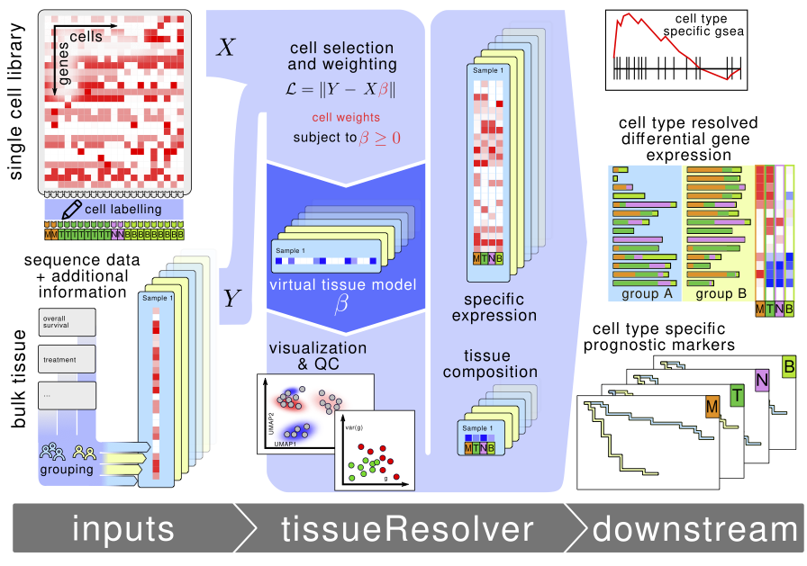

# tissueResolver Docs

`tissueResolver` is a package for converting bulk RNA-seq datasets into virtual tissues using information from similar single cell datasets by assigning weights to true single cells, maintaining their molecular integrity. Virtual tissues can be analyzed in a similar way as conventional single cell datasets.

<div style="text-align: center">
    
</div>

For theoretical details and interpretation of our results, see our preprint [bioarxiv](https://www.biorxiv.org/content/10.1101/2023.11.15.567357v1).

In this vignette we want to give a general overview over the most important functions
used when building a practical `tissueResolver` pipeline and provide reproducibility of the results of our paper. 
To round off this vignette we also provide several scripts allowing to reproduce all the results of our paper not covered by the vignette, see [Additional Scripts](#additional-scripts) for an overview.

For detailed explanation and examples of the main package functions of `tissueResolver` 
we refer to the corresponding R package and its documentation available under [Spang-Lab GitHub]( https://github.com/spang-lab/tissueResolver).

# Data Accessibility

We provide all the necessary data for download via the Zenodo DOI: [10.5281/zenodo.10568550](https://doi.org/10.5281/zenodo.10568550).

The case study of our paper is based on the following raw data:
- **bulk RNA-seq**: From the publication [Genetics and pathogenesis of diffuse large B-cell lymphoma](https://www.nejm.org/doi/10.1056/NEJMoa1801445?url_ver=Z39.88-2003&rfr_id=ori:rid:crossref.org&rfr_dat=cr_pub%20%200www.ncbi.nlm.nih.gov) by **[Schmitz et al., 2018]** accessible under [GDC](https://gdc.cancer.gov/about-data/publications/DLBCL-2018)
- **single cell RNA-seq**: Here we combined two datasets without further harmonisation:
    - [Dissecting intratumour heterogeneity of nodal B-cell lymphomas at the transcriptional, genetic and drug-response levels](https://www.nature.com/articles/s41556-020-0532-x) by **[Roider et al., 2020]** accessible under [heiDATA ID VRJUNV](https://heidata.uni-heidelberg.de/dataset.xhtml?persistentId=doi:10.11588/data/VRJUNV) or [EGAS00001004335](https://ega-archive.org/studies/EGAS00001004335)
    - [The landscape of tumor cell states and ecosystems in diffuse large B cell lymphoma](https://www.cell.com/cancer-cell/fulltext/S1535-6108(21)00451-7) by **[Steen et al., 2021]**, accessibly under [GSE182436](https://www.ncbi.nlm.nih.gov/geo/query/acc.cgi?acc=GSE182436) and [GSE182434](https://www.ncbi.nlm.nih.gov/geo/query/acc.cgi?acc=GSE182434)


We note that the data comprised in `bulks.rds` and `sc.rds` is the result of the gene 
filtering procedure explained in supplemental section **Gene filtering** of our paper.

# Building the .Rmd File

In order to render the .html file from `tissue_resolver_vignette.Rmd` invoke
```{r}
rmarkdown::render("tissue_resolver_vignette.Rmd")
```

If you want to run the code as a script you can simply extract it from the `.Rmd`` file via 

```{r}
knitr::purl("tissue_resolver_vignette.Rmd")
```


We intentionally set some computationally heavy R chunks to `eval = FALSE` and provided the output plots for a quick build.

Setting `eval = TRUE` and only storing `bulks.rds` and `sc.rds` in the `data` folder will compute everything from scratch.

If you run the `tissue_resolver_vignette.Rmd` for the first time, we provided all the data under Zenodo DOI: [10.5281/zenodo.10568550](https://doi.org/10.5281/zenodo.10568550).
For compiling `tissue_resolver_vignette.Rmd` you only need `sc.rds` and `bulks.rds` to be stored in the `data` folder.
The more additional data you provide, the less will be computed by `tissueResolver`.

# Additional Scripts

We provide several scripts to complement the vignette in order to allow for full reproducibility of the results of our paper:
- `simulations_paper.R` reproduces the benchmark simulation comparing `BayesPrism` with `tissueResolver`,
see section **Simulations** and in particular the pseudo algorithm we provide in the supplementary material of our publication.
- `bar_heatmap_DGE.R` reproduces the bar/heatmap plot for differentially expressed genes possessing good quality scores, see supplementary section **Differentially expressed genes in virtual tissues**
- `bar_heatmap_stromal.R` reproduces the bar/heatmap plot for genes belonging to the stromal signature, see section **The micro-environment of diffuse large B-cell lymphomas**
- `qc_all.R` reproduces the quality control plots for the whole set of 1000 analyzed genes, see supplementary section **Quality control of virtual tissues**
- `qc_stromal.R` reproduces the quality control plots for the genes contained in the stromal signature and their relation to cluster 17, see supplementary section **Quality control of virtual tissues**
- `map_feature_names.R` is a helper script converting ENSEMBL gene ids to HGNC symbols for a more convenient depiction of gene names